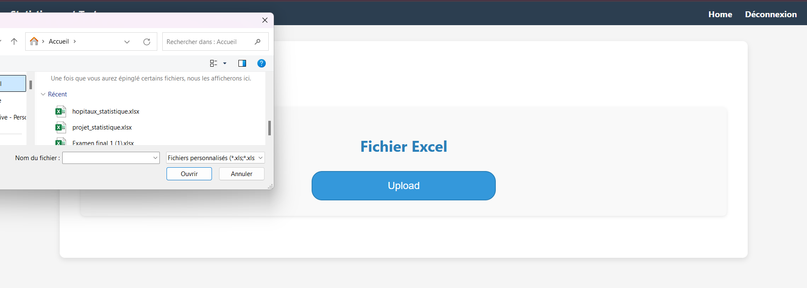

# Projet Django - Statistiques

Ce projet est une application Django dédiée aux statistiques et à la manipulation de données. Il utilise des bibliothèques populaires telles que **Pandas**, **NumPy**, **Plotly**, et d'autres pour offrir des fonctionnalités analytiques et interactives.

# Guide d'Installation et d'Exécution

## 1. Création et activation de l'environnement virtuel
Création : **python -m venv venv**
Activation : **venv\Scripts\activate**

## 2. Création et activation de l'environnement virtuel
Installez toutes les bibliothèques nécessaires avec la commande suivante :
**pip install -r requirements.txt**

## 3. Configuration du projet Django
### 1.  Lancez les migrations
Vous utilisez les commandes suivantes :
**python manage.py makemigrations**
**python manage.py migrate**

### 2.  Créez un superutilisateur
Pour gérer les connexions utilisateur et accéder à l'administration Django :
Utilisez la commande : **python manage.py createsuperuser**

### 3. Lancez le serveur local
Démarrez le serveur pour exécuter l'application :
Utilisez la commande : **python manage.py runserver**

### 4. Lancez le serveur local
Ouvrez votre navigateur et accédez à l'application via **http://127.0.0.1:8000**.

## Fonctionnalités principales

### 1. **Téléchargement de fichiers et calculs de statistiques**
- Importation de fichiers CSV et Excel.
- Calcul des **tendances centrales** : moyenne, médiane, mode.
- Calcul des **mesures de variabilité** : variance, écart-type, étendue.

### 2. **Loi de probabilités**
- Visualisation et simulation des lois suivantes :
  - **Bernoulli**
  - **Binomiale**
  - **Uniforme**
  - **Poisson**
  - **Exponentielle**
  - **Normale continue**

### 3. **Tests d'hypothèses**
- **Z-Test** (échantillons de grande taille, n > 30).
- **T-Test** (échantillons de petite taille, n < 30).
- Affichage interactif des résultats avec calculs des statistiques et p-values.

## Organisation de l'application

L'application est divisée en trois sections principales accessibles via le tableau de bord :

### 1. **Importation de fichiers et calculs statistiques**
- Permet de charger des fichiers **CSV** et**Excel**.

 

- Calcule les statistiques descriptives :
  - Moyenne
  - Médiane
  - Mode
  - Variance
  - Écart-type
  - Étendue

---

### 2. **Lois de probabilités**
Explorez et visualisez différentes lois de probabilité :
- **Bernoulli**
- **Binomiale**
- **Uniforme**
- **Poisson**
- **Exponentielle**
- **Normale continue**

---

### 3. **Tests d'hypothèses**
- Effectuez des **tests Z** et **tests T** pour analyser vos données.
- Affichez les résultats avec des visualisations conviviales et des calculs détaillés.

---

## Bibliothèques utilisées

L'application repose sur des bibliothèques robustes pour offrir des fonctionnalités avancées :

- **Django** : Framework backend pour le développement web.
- **Pandas** : Manipulation et analyse de données.
- **NumPy** : Calculs numériques avancés.
- **Plotly** : Visualisations interactives.
- **Matplotlib** et **Seaborn** : Visualisation des données.
- **SciPy** : Tests statistiques et distributions probabilistes.

## Conclusion

Ce projet offre une plateforme interactive et intuitive pour l'analyse statistique et probabiliste. Grâce à l'utilisation de bibliothèques puissantes comme Django, Pandas, NumPy, et Plotly, il permet de manipuler des données, d'explorer des lois de probabilité, et de réaliser des tests statistiques avec facilité. Que ce soit pour des besoins académiques, professionnels ou personnels, cette application constitue un outil polyvalent pour comprendre et interpréter vos données. 